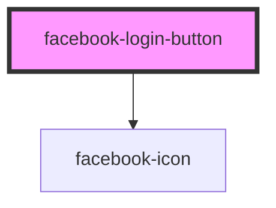

# my-component

<!-- Auto Generated Below -->

## Properties

| Property   | Attribute   | Description                                                                                                                                                                | Type                              | Default        |
| ---------- | ----------- | -------------------------------------------------------------------------------------------------------------------------------------------------------------------------- | --------------------------------- | -------------- |
| `authType` | `auth-type` | Comma-separated string of `auth_type`s, e.g. `rerequest`, `reauthenticate` or `reauthorize` See https://developers.facebook.com/docs/reference/javascript/FB.login#options | `string`                          | `""`           |
| `clientId` | `client-id` |                                                                                                                                                                            | `string`                          | `undefined`    |
| `disabled` | `disabled`  |                                                                                                                                                                            | `boolean`                         | `false`        |
| `expand`   | `expand`    |                                                                                                                                                                            | `"" \| "block"`                   | `""`           |
| `fields`   | `fields`    | Comma-separated string of fields to fetch.                                                                                                                                 | `string`                          | `undefined`    |
| `locale`   | `locale`    | Which Facebook locale the user will see.                                                                                                                                   | `string`                          | `undefined`    |
| `options`  | `options`   | Additional Facebook Login options. See https://developers.facebook.com/docs/reference/javascript/FB.login#options                                                          | `any`                             | `{}`           |
| `scope`    | `scope`     | Comma-separated string of scopes to request. See https://developers.facebook.com/docs/facebook-login/permissions                                                           | `string`                          | `undefined`    |
| `size`     | `size`      |                                                                                                                                                                            | `"large" \| "medium" \| "small"`  | `"large"`      |
| `type`     | `type`      | When `continue_with` is chosen the status will automatically be checked and the `facebookStatus` event will trigger if a user is found.                                    | `"continue_with" \| "login_with"` | `"login_with"` |
| `version`  | `version`   | Version of the Facebook API to use.                                                                                                                                        | `string`                          | `undefined`    |

## Events

| Event            | Description | Type                       |
| ---------------- | ----------- | -------------------------- |
| `facebookError`  |             | `CustomEvent<Error>`       |
| `facebookLogin`  |             | `CustomEvent<ISocialUser>` |
| `facebookStatus` |             | `CustomEvent<ISocialUser>` |

## Dependencies

### Depends on

- [facebook-icon](../facebook-icon)

### Graph

----------------------------------------------

*Built with [StencilJS](https://stenciljs.com/)*
