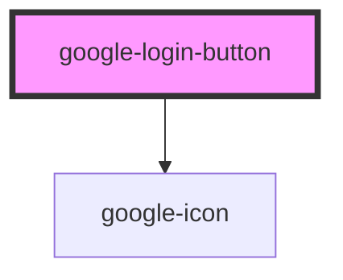

# google-login-button

<!-- Auto Generated Below -->

## Properties

| Property      | Attribute      | Description                                  | Type                             | Default           |
| ------------- | -------------- | -------------------------------------------- | -------------------------------- | ----------------- |
| `checkStatus` | `check-status` |                                              | `boolean`                        | `false`           |
| `clientId`    | `client-id`    |                                              | `string`                         | `undefined`       |
| `disabled`    | `disabled`     |                                              | `boolean`                        | `false`           |
| `expand`      | `expand`       |                                              | `"" or "block"`                  | `""`              |
| `loadFont`    | `load-font`    |                                              | `boolean`                        | `true`            |
| `scope`       | `scope`        | Space-separated string of scopes to request. | `string`                         | `"profile email"` |
| `size`        | `size`         |                                              | `"large" or "medium" or "small"` | `"large"`         |

## Events

| Event          | Description | Type                       |
| -------------- | ----------- | -------------------------- |
| `googleError`  |             | `CustomEvent<Error>`       |
| `googleLogin`  |             | `CustomEvent<ISocialUser>` |
| `googleStatus` |             | `CustomEvent<ISocialUser>` |

## Dependencies

### Depends on

- [google-icon](../google-icon)

### Graph

----------------------------------------------

*Built with [StencilJS](https://stenciljs.com/)*
